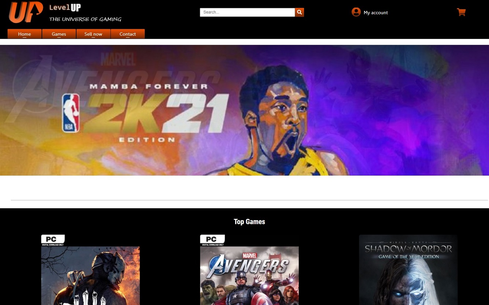

# Lvl Up, Gaming Project

This was my first project. The purpose of this project was to consolidate my knowledge of the basic languages to start my career as a frontend, HTML, CSS and Javascript. With this, I managed to create this website and learn a lot about the basics of these 3 technologies

## Description

The project consists of creating a video game website. Which has a cover with different sections. The games are saved in an API created with Strapi, and are displayed in cards with information. In addition, you can access the details of each game. Since at the end of my first year, I modified the project to be able to generate the details page dynamically.
The website is not complete, since its objective is to connect the page with the API and show as a result the cards and the information that is hosted in the API.

## Built with

- HTML
- CSS
- Vanilla Javascript

## Contact

https://www.linkedin.com/in/mariano-david-franco-gallo/
